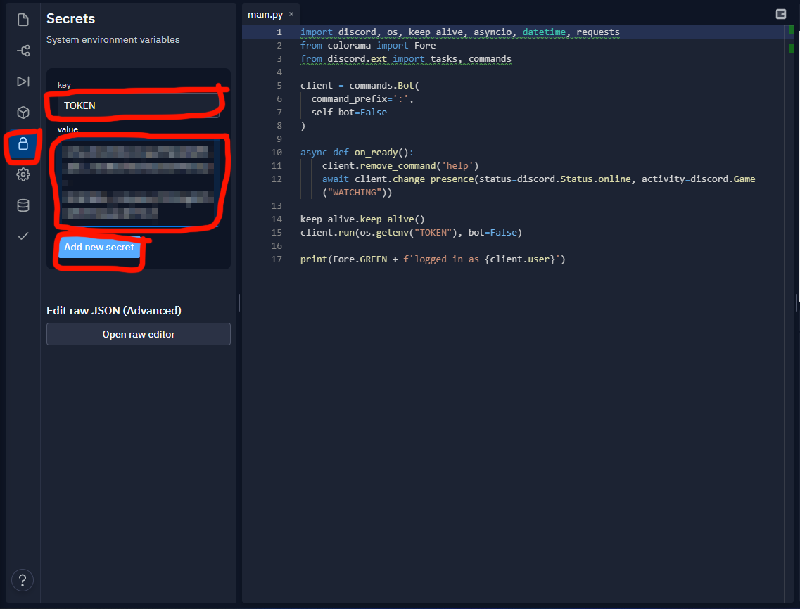

# Discord-Banner-Image

string member server and mic total

## Installation Replit

🧿 Replit : [Here](https://replit.com)

🌀 UptimeRobot : [Here](https://uptimerobot.com)

## How Run Replit

ADD TOKEN VALUE

JUST .RUN.
